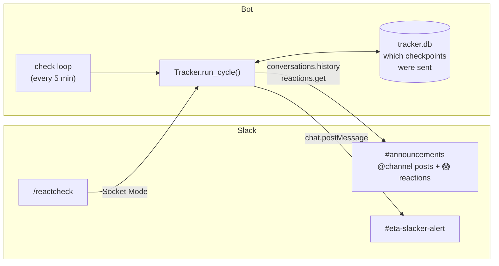

# How it works

This page is for anyone who wants to change or extend the bot.

## Overview



The bot is **poll-based**. Every `check_interval_minutes`, it:

1. Reads the watched channel's messages from the last `deadline_hours + 2` hours (`conversations.history`), and keeps the ones containing `<!channel>`. This is how Slack encodes `@channel` in message text.
2. For each announcement that isn't finished, it gets the full list of people who reacted (`reactions.get`) and compares it to the roster.
3. Works out which **checkpoints** are due: halfway, each `warn:<hours>` warning, and the deadline. A checkpoint is due if its time has passed and it hasn't been sent yet.
4. If any are due, it posts the **latest** one and records all of them as sent.
5. Marks an announcement as finished once everyone has reacted (and posts 🎉 if it had already sent an update) or once the deadline has passed.

Polling means the bot doesn't need to receive events from Slack. Setup is simpler, nothing is lost while the bot is offline, and after a restart it catches up on its own. Socket Mode is used only for the `/reactcheck` command.

## Code layout

| File | What's in it |
|---|---|
| [`bot/tracker.py`](../bot/tracker.py) | All the logic: detecting announcements, matching reactions, the checkpoint schedule, message text |
| [`bot/main.py`](../bot/main.py) | Command-line entry point, the background check loop, and the `/reactcheck` command handlers |
| [`bot/resolve.py`](../bot/resolve.py) | Turns channel names and roster entries (emails and names) into Slack IDs |
| [`bot/store.py`](../bot/store.py) | SQLite storage: which checkpoints were sent and which announcements are finished |
| [`bot/config.py`](../bot/config.py) | Loads settings from `config.yaml`/`CONFIG_YAML` and environment variables |
| [`bot/members.py`](../bot/members.py) | The `python -m bot.members` helper |
| [`manifest.yaml`](../manifest.yaml) | Slack app definition: permissions, slash command, Socket Mode |

## Development

```bash
python3 -m venv .venv && source .venv/bin/activate
pip install -r requirements.txt pytest
pytest
```

The tests don't need a Slack workspace. They use a `FakeClient` that stands in for the Slack API and a fake clock, so a full 24-hour schedule runs in milliseconds. See [`tests/test_tracker.py`](../tests/test_tracker.py).

### Command-line flags

```bash
python -m bot.main                  # run continuously
python -m bot.main --status         # print who's missing, then exit
python -m bot.main --once           # run one check (post anything that's due), then exit
python -m bot.main --once --force   # post a reminder for every open announcement now
python -m bot.main --config other.yaml
python -m bot.members [--check]
```

### Ideas for extending it

- **Per-announcement deadlines.** Read something like "react by Friday 5pm" from the announcement text and use it instead of `deadline_hours`. The place to change is `checkpoints()` in `tracker.py`.
- **Weekly leaderboard.** `tracker.db` already tracks announcements. Add a table that records who was missing at each deadline, and post a weekly summary.
- **Restrict `/reactcheck-remind` to officers.** Check `command["user_id"]` against a list in the config.
